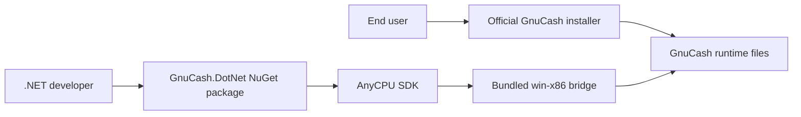

# System Context

```mermaid
flowchart LR
  Developer[".NET developer"] --> NuGet["GnuCash.DotNet NuGet package"]
  NuGet --> Sdk["AnyCPU SDK"]
  Sdk --> Bridge["Bundled win-x86 bridge"]
  User["End user"] --> Installer["Official GnuCash installer"]
  Installer --> GnuCash["GnuCash runtime files"]
  Bridge --> GnuCash
```