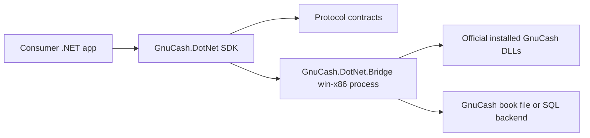

# Architecture Overview

GnuCash.DotNet keeps the .NET developer experience separate from the native GnuCash runtime.

The SDK is AnyCPU-friendly. The bridge is explicitly `win-x86` so x64 applications can use the official Windows GnuCash install without loading 32-bit DLLs in-process.